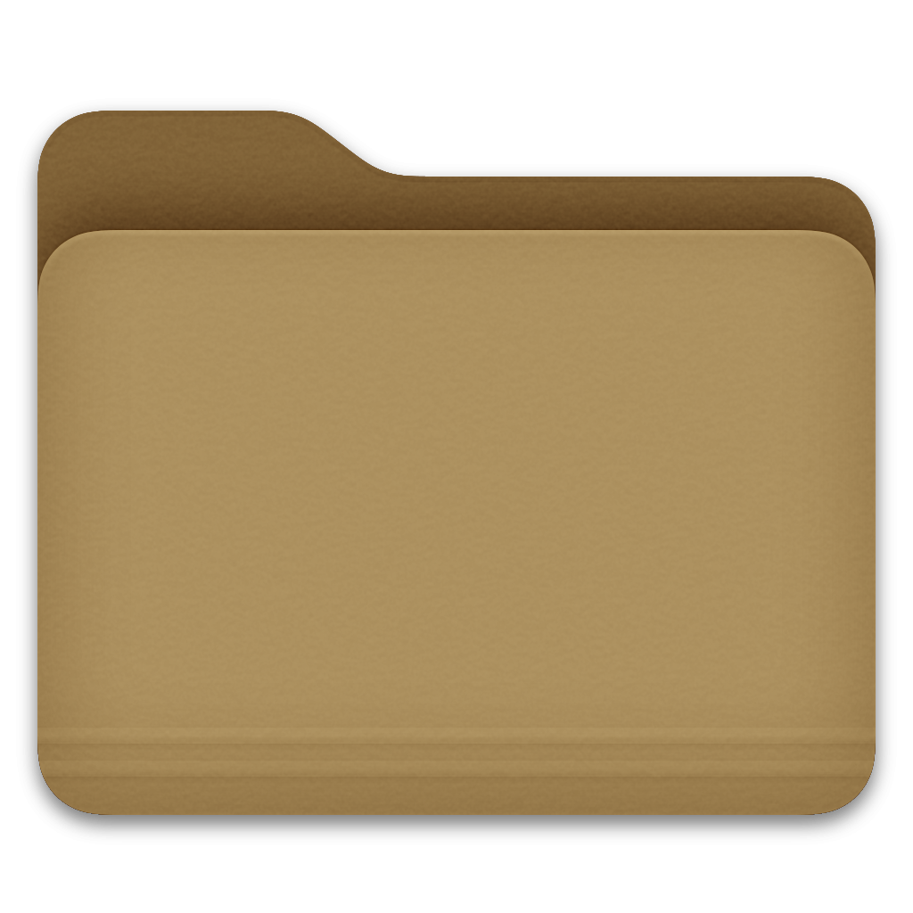
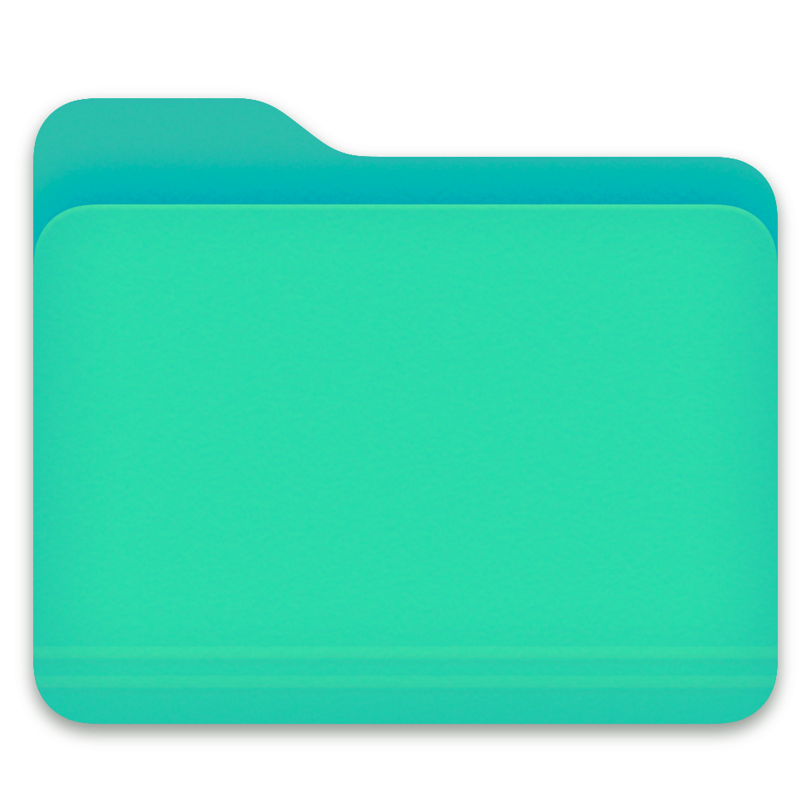
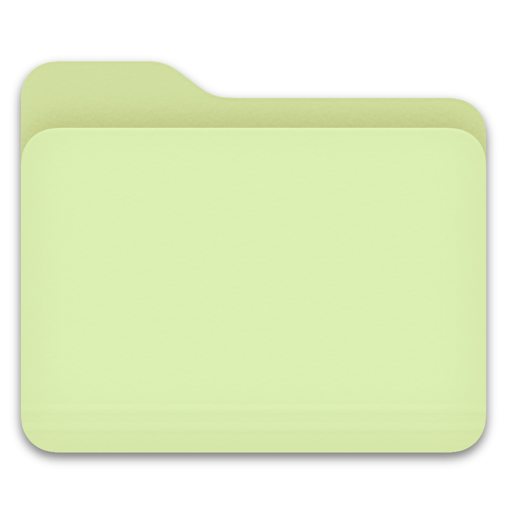
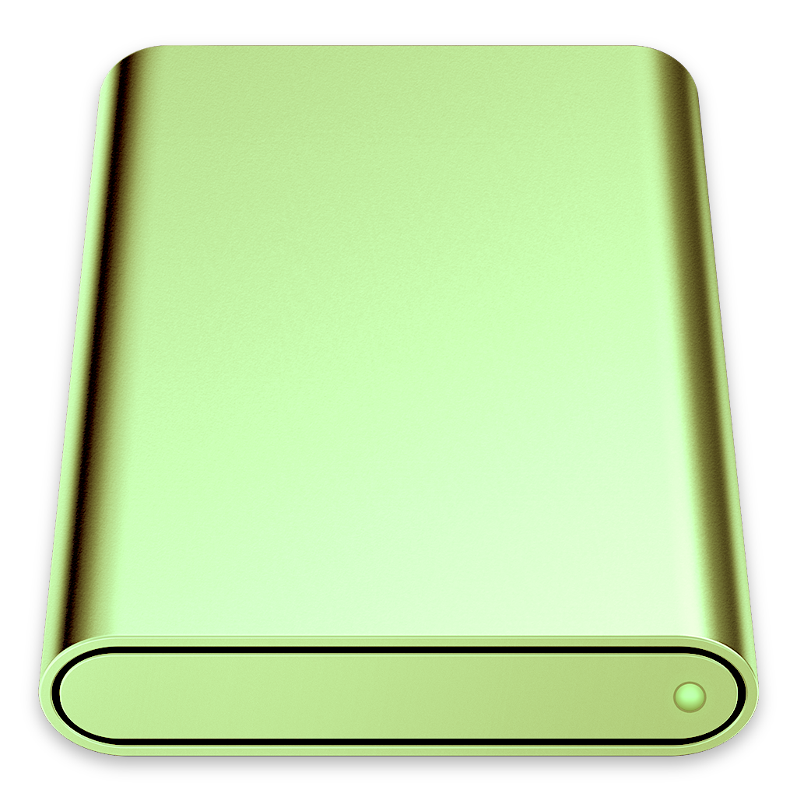

  

## Mac Folder Status Colors - Demo Video
This video showcases a demo of the Mac folder color-changing tool.

# MacFolderStatusColors

Mac folder icons with color-coded status indicators.  
Quickly distinguish project phases: **testing (green), development (red), clones (white), and more!**

## Icon Preview
| Brown | Emerald | Yellow-Green | Light Blue | Disk |
|--------|--------|--------------|------------|------|
|  |  |  |  |  |

| Neon Orange |  |  |  |  |
|--------------|----|----|----|----|
|  |  |  |  |  |

## How to Use
1. Open the `.png` file in **Preview.app**.
2. Press `Command + A` → `Command + C` (Copy).
3. Open `Finder`, select the folder you want to change, and press `Command + I` (Get Info).
4. Click on the folder icon in the top left and press `Command + V` (Paste).

## Contribute
If you need more colors, feel free to request them via **Issues** or **Pull Requests**!  
